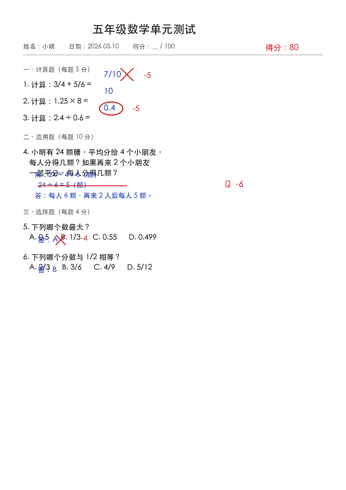
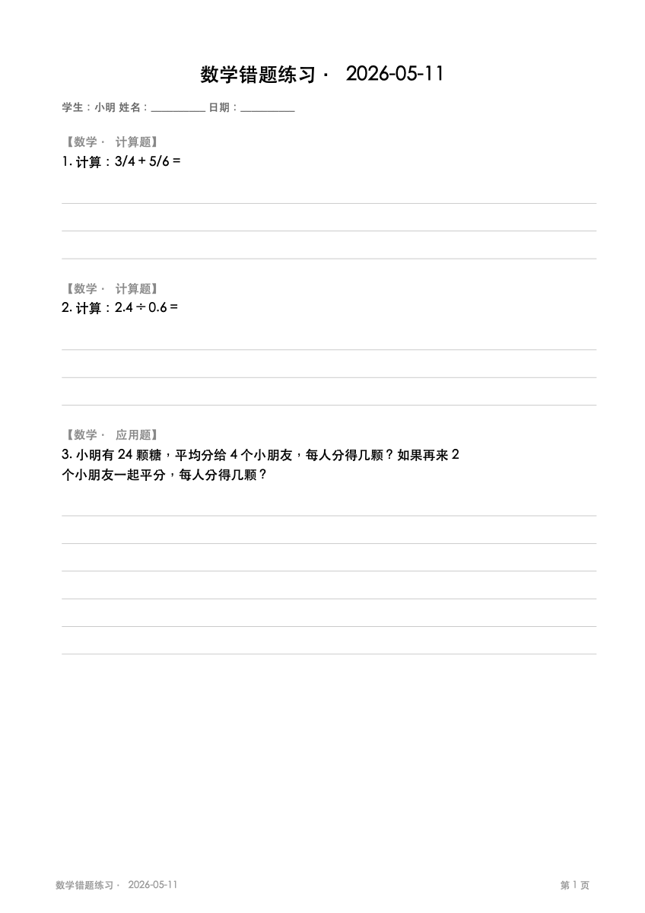

# wrongbook · 错题整理 Claude Code 插件

把老师批改过的试卷照片，自动整理成纯练习版 PDF，给学生重做；同时累积本地错题库，可按学科/时间区间随时出复习练习。

无需额外 API key——完全跑在你自己的 Claude Code 之上。

---

## 效果预览

| 输入：批改过的试卷 | 输出：纯练习版 PDF |
|:--:|:--:|
|  |  |

---

## 功能

- **A. 整理新试卷**：拖一张或多张带红笔批改（红叉/红圈/扣分）的试卷照片给 Claude，自动定位错题、抽取结构化数据、生成只含题目和空白作答区的练习版 PDF
- **B. 从错题库出题**：用自然语言描述条件，从历史错题里挑题出 PDF，例如：
  - "把这周的数学错题做成练习"
  - "从错题本里随机抽 10 道应用题"
  - "把上个月所有错题打印出来"
- 错题持久化为 JSON 文件（`output/sessions/`），人可读、易备份、不依赖数据库
- PDF 自动按学科分章、带页码、中文字体自动适配（macOS / Linux / Windows）

## 安装

### 通过 Claude Code marketplace 安装

```bash
# 在 Claude Code 内执行
/plugin marketplace add https://github.com/TongWei1105/easy_homework
/plugin install wrongbook
```

### 本地手动安装（开发/调试）

```bash
# 直接克隆到任意位置，然后启动 Claude Code 时指定
git clone https://github.com/TongWei1105/easy_homework
claude --plugin-dir ./easy_homework
```

### 依赖

宿主机需要 Python 3.8+ 和两个包：

```bash
pip3 install --user reportlab pillow
```

## 使用示例

### A. 整理一张试卷

把试卷图（手机拍的就行）拖给 Claude，说：

> 帮我整理这张试卷的错题

Claude 会：
1. 读图、定位红笔批改的题
2. 抽取每道错题为结构化 JSON
3. 写到 `output/wrongbook_<时间戳>.json`
4. 同步入库到 `output/sessions/`
5. 生成 `output/wrongbook_<时间戳>.pdf`，告诉你路径

### B. 从错题库出题

跟 Claude 说：

> 把这周的数学错题做成一份练习

或者：

> 从错题本里随机抽 10 道应用题

会输出 `output/practice_<时间戳>.pdf`。

### C. 看库

```bash
# 看库里有什么
python3 ~/.claude/plugins/wrongbook/skills/wrongbook/scripts/store.py stats

# 列最近的 session
python3 ~/.claude/plugins/wrongbook/skills/wrongbook/scripts/store.py list-sessions
```

## 数据存哪里

- **抽取产物 / 复习 PDF**：`./output/`（你当前工作目录下）
- **错题库**：`./output/sessions/<时间戳>.json`（项目本地，每个项目独立一份错题史）
- **PDF**：和对应 JSON 同名同目录

可以直接 iCloud/Dropbox/git 同步备份。坏了就手动改 JSON。

## 当前覆盖范围

| 学科 | 题型 | 状态 |
| --- | --- | --- |
| 数学（小学/初中） | 计算、应用、选择、填空 | ✅ |
| 语文 | 默写、阅读、作文 | ✅ |
| 英语 | 选择、翻译、阅读 | ✅ |
| 理化生 | 大部分文字题 | ✅（含图表的题暂用文字描述） |

## 已知限制（待版本）

- 数学公式只支持纯文本（`3/4 + 5/6`），未来会加 LaTeX → 图片
- 几何图、化学结构图等无法自动嵌入 PDF（题干中文字描述代替）
- 暂未追踪"哪些错题已被重做过"

## 项目结构

```
.
├── .claude-plugin/plugin.json   # plugin 元数据
├── skills/wrongbook/
│   ├── SKILL.md                 # 触发说明 + 工作流指令
│   ├── scripts/
│   │   ├── generate_pdf.py      # JSON → PDF
│   │   └── store.py             # 文件版错题库
│   └── examples/                # 抽取指南、样例输入、模拟试卷
├── README.md                    # 你正在看的这个
└── LICENSE
```

## License

MIT — 见 [LICENSE](./LICENSE)。
